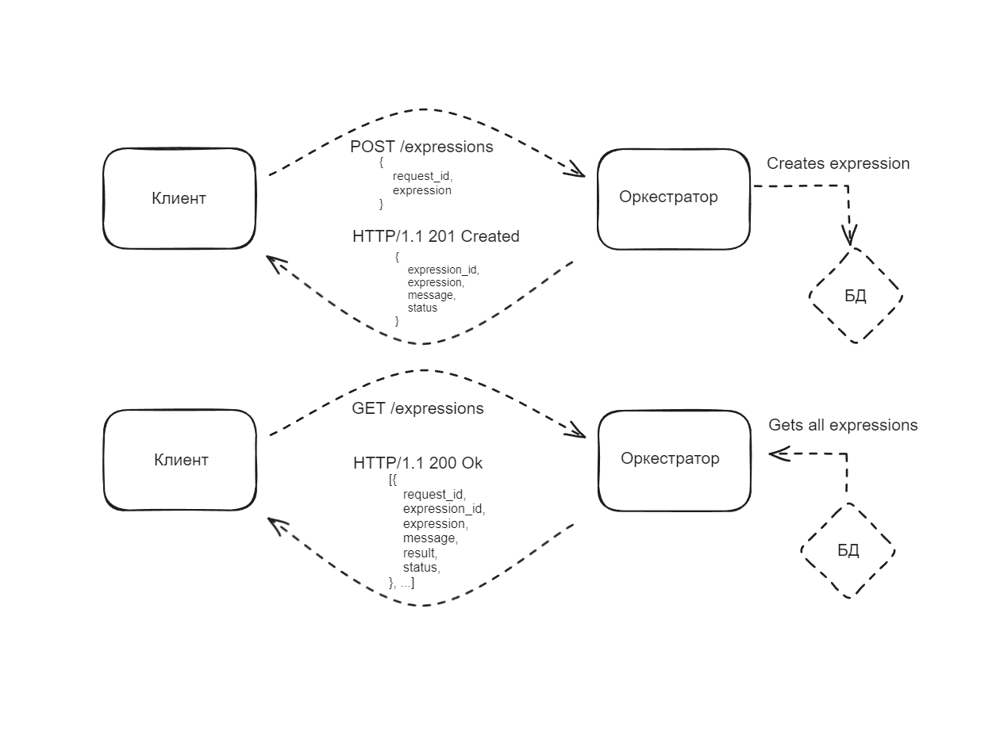
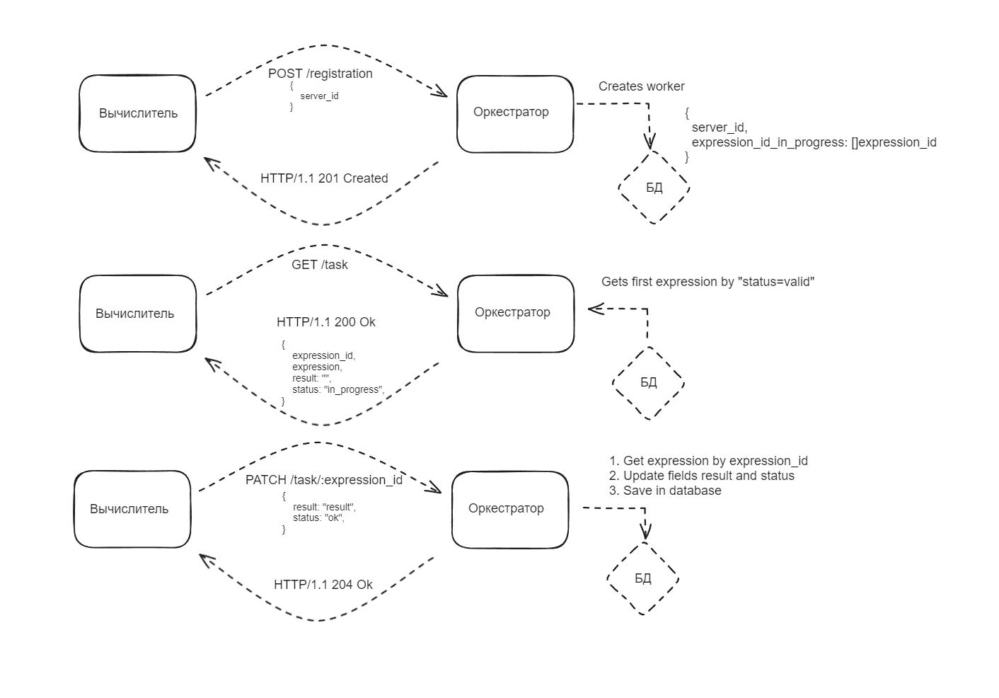

# GoCalculator
Распределенный вычислитель арифметических выражений на Golang

## Summary
### Что сделано по задаче
- Веб-сервер, который отображает страничку с формой, заполнив которую можно отправить POST запрос на сервер-оркестратор и получить от него ответ в виде `json`. Далее ответ парсится, а затем на страницу добавляется html-элемент, на котором отражено выражение, его краткое описание и статус выражения.
- Сервер-окестратор, который получает POST запрос из формы с web-сервера, убирает из выражения все пробелы, валидирует его и отдает ответ на сервер в виде `json`. Оркестратор умеет создавать модель Expression, сохранять ее в БД, извлекать из БД все выражения или конкретное выражение по параметру `expression_id`.
- Добавил базу данных для сохранения оркестратором поступивших к нему выражений. Сервер-оркестратор сохраняет все выражения в БД, которые можно увидеть на странице по endpoint `/expressions` или можно увидеть конкретное выражение для параметра expression_id по endpoint `/expressions/:expression_id`.
- Сервер-вычислитель, который пока просто запускается и умеет написать, что он запустился.
- Упаковал все сервисы в `docker-compose`, настроил их сборку и запуск, добавил горячую перезагрузку сервисов с помощью библиотеки `air`. 
- Написал README.md

### Что не сделано по задаче
- Не распарсил выражения.
- Не реализовал логику работы по API оркестратора и вычислителя.
- При перезагрузке страницы с формой состояние теряется и выражения, отображенные на странице, пропадают.

### Схемы взаимодействия
- Схема взаимодействия web-сервера и сервера-оркестратора


- Схема взаимодействия сервера-оркестратора и сервера-вычислителя


## Introduction  
### Условия задачи
---
Пользователь хочет считать арифметические выражения. Он вводит строку 2 + 2 * 2 и хочет получить в ответ 6. Но наши операции сложения и умножения (также деления и вычитания) выполняются "очень-очень" долго. Поэтому вариант, при котором пользователь делает http-запрос и получает в качетсве ответа результат, невозможна. Более того вычисление каждой такой операции в нашей "альтернативной реальности" занимает "гигантские" вычислительные мощности. Соответственно, каждое действие мы должны уметь выполнять отдельно и масштабировать эту систему можем добавлением вычислительных мощностей в нашу систему в виде новых "машин". Поэтому пользователь, присылая выражение, получает в ответ идентификатор выражения и может с какой-то периодичностью уточнять у сервера "не посчиталость ли выражение"? Если выражение наконец будет вычислено - то он получит результат. Помните, что некоторые части арфиметического выражения можно вычислять параллельно.

Проект состоит из двух частей Front-end и Back-end.
---
### Front-end
---
GUI, который можно представить как 4 страницы:
- Форма ввода арифметического выражения.

  Пользователь вводит арифметическое выражение и отправляет POST http-запрос с этим выражением на back-end. Примечание: Запросы должны быть идемпотентными. К запросам добавляется уникальный идентификатор. Если пользователь отправляет запрос с идентификатором, который уже отправлялся и был принят к обработке - ответ 200. Возможные варианты ответа:
  - 200 (выражение успешно принято, распаршено и принято к обработке)
  - 400 (выражение невалидно)
  - 500 (что-то не так на back-end)   
  В качестве ответа нужно возвращать id принятного к выполнению выражения.

- Страница со списком выражений в виде списка с выражениями. Каждая запись на странице содержит статус, выражение, дату его создания и дату заверщения вычисления. Страница получает данные GET http-запрсом с back-end-а
- Страница со списком операций в виде пар: имя операции + время его выполнения (доступное для редактирования поле). Как уже оговаривалось в условии задачи, наши операции выполняются "как будто бы очень долго". Страница получает данные GET http-запрсом с back-end-а. Пользователь может настроить время выполения операции и сохранить изменения.
- Страница со списком вычислительных можностей. Страница получает данные GET http-запросом с сервера в виде пар: имя вычислительного ресурса + выполняемая на нём операция.

### Back-end
---
Состоит из 2 элементов:
- Сервер, который принимает арифметическое выражение, переводит его в набор последовательных задач и обеспечивает порядок их выполнения. Далее будем называть его оркестратором.
- Вычислитель, который может получить от оркестратора задачу, выполнить его и вернуть серверу результат. Далее будем называть его агентом.

#### Оркестратор
Сервер, который имеет следующие endpoint-ы:
- Добавление вычисления арифметического выражения.
- Получение списка выражений со статусами.
- Получение значения выражения по его идентификатору.
- Получение списка доступных операций со временем их выполения.
- Получение задачи для выполения.
- Приём результата обработки данных.

#### Требования: 
- Оркестратор может перезапускаться без потери состояния.
- Все выражения храним в СУБД.
- Оркестратор должен отслеживать задачи, которые выполняются слишком долго (вычислитель тоже может уйти со связи) и делать их повторно доступными для вычислений.

## Requirements
### Для работы проекта необходимо следущее программное обеспечение или библиотеки:
`Golang v. 1.21.6`, `Docker`, `Docker Compose`.

- Для установки `Golang` перейти по ссылке https://go.dev/dl/, установить согласно инструкции для своей операционной системы.
- Для установки `Docker` перейти по ссулке https://www.docker.com/get-started/, установить согласно инструкции для своей операционной системы.
- Для установки `Docker Compose` перейти по ссулке https://docs.docker.com/compose/install/, установить согласно инструкции для своей операционной системы.

## Installation and Usage
### Инструкции по установке и использованию 
__Команды указаны для операционной системы Linux и терминала `bash`__
1. Установить необходимое программное обеспечение и библиотеки (_смотри предыдущий раздел_).
2. Клонировать репозиторий на локальный компьютер
```bash
git clone https://github.com/EvSedov/GoCalculator.git
```
3. Перейти в папку проекта 
```bash
cd GoCalculator
```
4. Собрать проект командой `docker-compose build`
5. Запустить проект командой `docker-compose up`
  - Web-сервер запуститься на http://127.0.0.1/
  - Оркестратор запустится на http://127.0.0.1:81, для проверки работы базы данных уже добавленные выражения можно посмотреть перейдя по пути `/expressions` для данного `URL`
  - Вычислитель запустится на http://127.0.0.1:85, посмотреть текст о том, что вычислитель запустился можно перейдя по пути `/calc` для данного `URL` (на странице браузера должна появиться надпись `Server calculator is started!`)
6. Для остановки проекта в терминале нажать комбинацию клавиш `Ctrl+C`


## License
- тип лицензии, под которой распространяется проект Apache License 2.0

## Authors and Contacts
Автор: Евгений Седов

Телеграм для связи: @evsedov 
